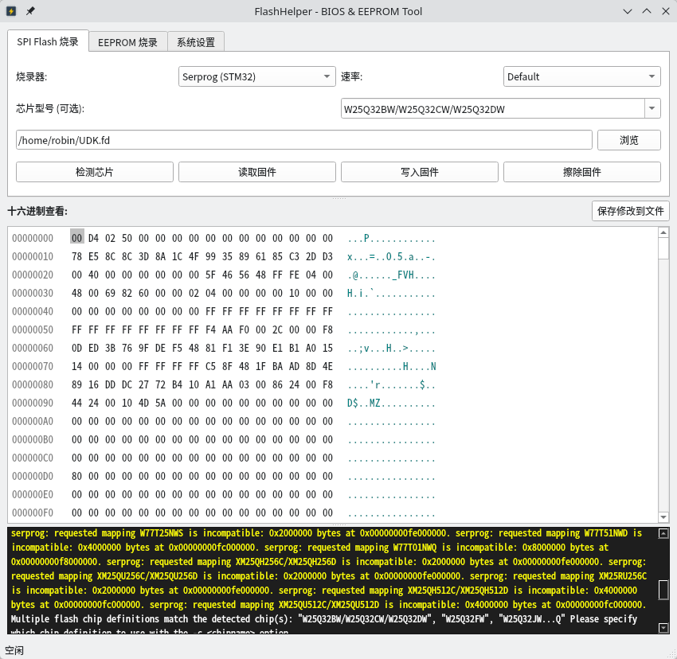

<div align="center">


# FlashHelper

**A Modern, Cross-Platform GUI for Flashrom with First-Class LoongArch Support**

[](LICENSE)
[](https://www.qt.io/)
[](https://loongson.cn)
[](https://kernel.org)

[**Features**](#features) | [**Quick Start**](#quick-start) | [**LoongArch Support**](#loongarch-support) | [**Building**](#building) | [**中文文档**](#中文简介)

</div>

---

## Introduction

**FlashHelper** is a lightweight, intuitive Qt-based graphical interface for `flashrom`. It simplifies BIOS and EEPROM firmware operations, making it accessible to developers and hardware enthusiasts without diving into the command line.

Specifically optimized for **LoongArch (龙架构)**, FlashHelper bridges the gap between powerful CLI tools and user-friendly desktop environments.

## Features

- 🔌 **Universal Programmer Support**: Supports Serprog (STM32), CH341A, FT2232, Bus Pirate, Dediprog, and more.
- 🐉 **LoongArch Native**: Built-in support for Loongson Internal SPI controllers.
- 📝 **Integrated Hex Editor**: Instant visualization and navigation of firmware contents directly within the app.
- 🧠 **Smart Write**: Automatically handles firmware/chip size mismatches by merging existing data—protecting your system from incomplete writes.
- 🛡️ **Udev Wizard**: One-click installation of hardware access rules to resolve `Permission Denied` errors without manually editing system files.
- 📦 **AppImage Ready**: Optimized for portable deployment across different Linux distributions.

## Screenshots

<div align="center">
  
  <p><i>The intuitive main interface showing the Hex Editor and Programmer controls.</i></p>
</div>

---

## Quick Start

### 1. Identify Your Chip
Connect your programmer and click **"Detect"**. FlashHelper will automatically query the chip ID and model.

### 2. Permissions
If you encounter permission issues, go to the **System Config** section and click **"Install Udev Rules"**. This will grant your user account the necessary permissions to access hardware directly.

### 3. Read & Write
- **Read**: Dump your current BIOS to a file.
- **Write**: Load a new firmware and flash it. FlashHelper will verify the write automatically.

---

## LoongArch Support

FlashHelper is a first-class citizen in the LoongArch ecosystem. It includes:
- **Loongson SPI Controller**: Direct support for flashing BIOS on Loongson 3A5000/3A6000 machines.
- **Custom Patch**: Includes `flashrom_la.patch` for `flashrom` v1.2.x/v1.3.x, ensuring compatibility with the latest Loongson hardware.

---

## Building

### Prerequisites

- Qt 5.15+ or Qt 6.x
- CMake 3.16+
- `libflashrom` dependencies (e.g., `libpci-dev`, `libusb-1.0-0-dev`, `libftdi1-dev`)

### Build Steps

```bash
git clone --recursive https://github.com/yourusername/flashhelper.git
cd flashhelper
mkdir build && cd build
cmake ..
make -j$(nproc)
```

### Packaging (AppImage)

To generate a portable AppImage:
```bash
./make_appimage.sh
```

---

## 中文简介

**FlashHelper** 是一个基于 Qt 开发的 `flashrom` 图形化界面工具，旨在为 BIOS 和 EEPROM 的固件读写、探测及擦除提供直观的操作体验。

### 核心特性
- **龙架构支持**：深度适配 LoongArch 平台，内置龙芯内部 SPI 控制器驱动。
- **智能写入**：自动处理固件文件与芯片大小不匹配的情况，实现安全覆盖。
- **内置十六进制查看器**：实时查看读出的固件数据，支持地址跳转与搜索。
- **自动化权限管理**：一键安装 udev 规则，解决 Linux 下常见的硬件访问权限问题。

### 硬件支持
支持包括 Serprog, CH341A, FT2232, Bus Pirate 在内的数十种主流编程器。

---

## Contributing

Contributions are welcome! Please feel free to submit a Pull Request.

## License

This project is licensed under the [GPL-2.0](flashrom/COPYING.rst) license.

---

<div align="center">
  Developed by Robin. Built for the community.
</div>
